# **爬取天眼查、企查查、爱企查信息**  

## 一、引言：

> 通过自动化快合报税系统中在爬虫方面的了解和之前对Python中的selenium包的学习，开发一个有交互式界面的爬虫程序。

## 二、编写目的：

>实现自动化对多个网站中给定的企业名称来爬取所需的信息。
 
## 三、参考资料：

>网上对selenium所开发的爬虫程序和pyqt5所开发的ui交互式界面以及快合系统中的爬虫项目。

## 四、目标：

>以登录的方式实现自动化爬取天眼查中企业的信息，并将数据以一定格式保存，以便于他人使用。 

## 五、对现有系统的分析：

### 1、程序方面：

>可实现轻量型数据的爬取需求，因是通过登录的方式实现，对爬取数量上有一个限制，在累计达到90条左右的数量上，网页就会提示四字成语的图片验证，代码在获取网页元素的时候会受到影响，导致程序在运行，但不能爬取到数据，不能实现自动化无限制的爬取所需；

>托块验证的解决上，结合所编写程序的功能实现的程度，对这方面实现了一个可选择的小补救措施，通过选择实现托块验证的方法，提高托块验证的成功率，使该程序有更高的使用性；

>对爬取过程的数据展示，可实现对整个爬取过程的查看；但是对整个程序的运行过程提示信息没有实现，在设计UI界面时没有更全面的考虑；

>所爬取数据的呈现形式是依靠TXT文件，可能对本公司的业务数据需求不是十分的对口，可改进数据的展现形式和特定数据的爬取需求，干扰数据较多，对这一方面有所考虑，但效果不是很显著，弃用；

>没有访问数据库的能力，只能是“一次性”程序；这一方面在设计上没有考虑，之后若有需求，可再回炉。

### 2、UI方面：

>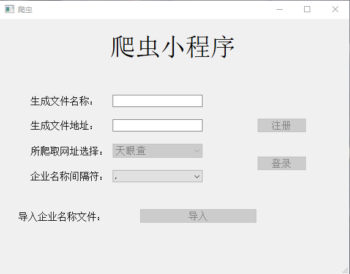
>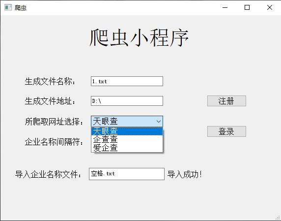

>>通过对生成文件，地址，导入的企业名称文件的填写，对登录、注册的选择，以及对所爬取网站的选择，实现对所需数据的获取和不同的实现方式，且含有提示信息；

>>对“导入文件”、“注册”、“登录”等按钮的点击出发有限制条件，方便使用者更好的运行该程序，实现功能。

>>爱企查：

>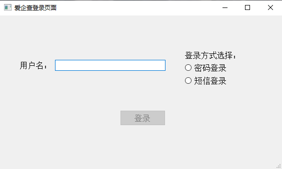
>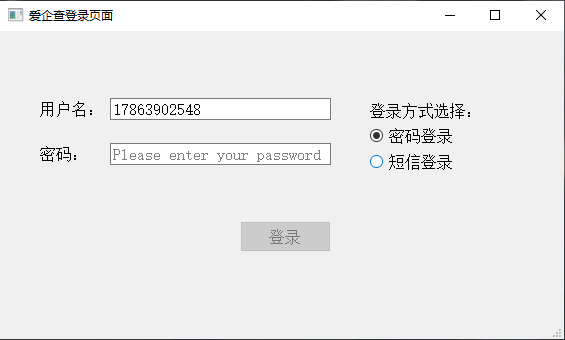
>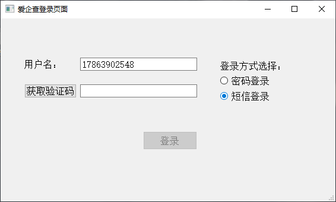

>>天眼查：

>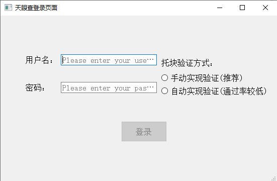

>>企查查：

>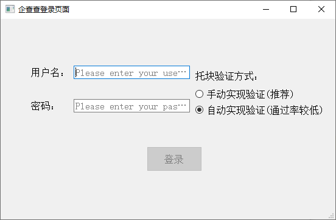

>>通过已有账号来实现用户的登陆操作,且因托块验证的编码问题，通过选择两种方式来更好的实现爬取数据。

>>天眼查：

>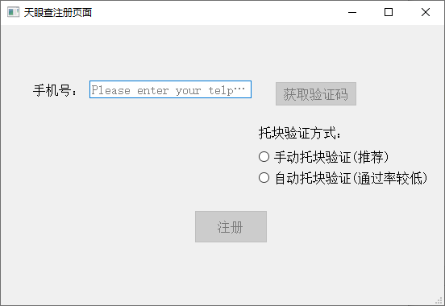
>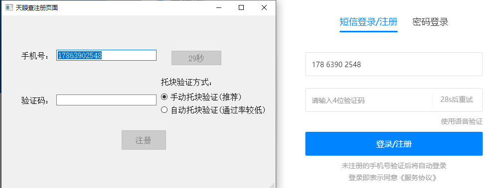

>>企查查：

>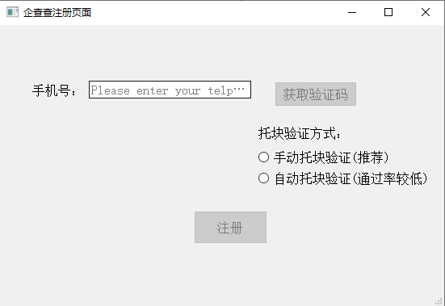
>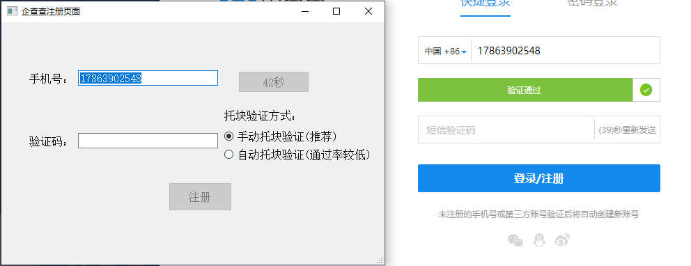

>>通过获取验证码的顺序对相应控件的编码，实现注册功能，不会因误操作而使程序崩溃；

>>“验证码输入框”和“注册”控件存在限制条件，实现对程序的运行顺序的保护。

>

>

>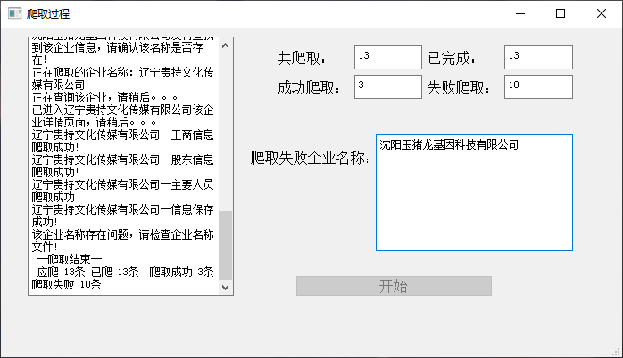

>>点击“开始”按钮，开始运行程序；左侧可现实爬取过程的实时提示信息查看，右侧可查看爬取程序的运行程度；下方有爬取失败的企业名称，方便对失败企业的名称和对程序的检测，以及二次爬取，提高效率。

## 六、改进之处、目标：

### 1、在ui界面上：

>对页面的布局美观，以及在界面上可逆性的功能设置。

### 2、在程序上：

>对代码的复用性较低，较为繁琐；对具体功能的优化：在自动化解决托块的问题和爬取数量的问题上有待优化。

## 七、项目概述 

### 1、通过selenium实现爬虫的整体功能：
>对chrome浏览器的控制和对网页中元素的定位、点击，输入框的输入和清除以及对拖拉按钮的使用等，以及对网页上的表格数据的遍历接受；

### 2、通过pyqt5实现ui界面的功能：

>实现用户输入数据的接收，运行数据的展示，在输入框中的提示字样和在密码上的隐藏功能，按钮实现特定的功能，对按钮的限制，提高程序的健壮性，以及提示框功能的实现。

## 八、数据需求：

>Txt文件格式的企业名称文件，且已知每个企业名称之间的间隔符。

## 九、概要设计：

### 1、基本设计概念：

>通过交互界面，填写天眼查网站登录所需的信息和爬取数据所生成文件的地址和文件名称，导入所需的企业名称文件，运行爬虫程序，在导入
>企业名称文件内的企业爬取完成后，提示爬取成功，获得所需要的数据。

### 2、运行控制：

>对'导入'，'登录'，'注册'，'开始'，等按钮的相关限制，实现对程序的正确运行顺序的保护。

## 十、操作手册：

### 1、自动化拖块验证：

>双击运行程序，在交互界面上依次填入所提示的信息，然后依照使用者是否有所访问网址的账号来选择登录的方式：

>>登录：通过填写账号和密码以及选择托块验证的通过方式实现登录操作；

>>注册：通过填写手机号码，点击获取验证码，选择托块验证方式，以及界面上会显示填写验证码的输入框来实现新用户的注册操作。

>>运行：点击开始按钮开启运行程序，待爬取结束，点击完成，即可退出该爬虫程序。

### 2、手动解决拖块验证：

>在登录和注册页面上存在选项，选择手动解决托块验证，在程序运行至需要托块验证时，手动实现验证，即可。

## 十一、项目开发总结： 

### 1、个人开发评价：

>开发时间较长，对新知识的上手速度较慢，在整体逻辑上存在过多问题，想法设计和编码实现这方面的能力较为欠缺；应在具体问题的解决方式上有所改观，才能在编码上有更大的提高空间。 
 
### 2、出错原因的分析：

#### (1)、在爬虫程序设计上：

>>编写辨别拖块移动距离上，因拖块的大小原因，对移动距离所造成的误差，解决方法应先将拖块移动至最右侧，再截图，获取移动距离，即可解决该问题，虽然仍存在误差，但所产生的误差对于托块验证可忽略；

>>一个公司信息爬取完成后，跳转到上一网站继续操作上，没有较好的逻辑性，导致一开始解决时所浪费的时间，应解决网页句柄的跳转选择，即可解决该问题；

>>爬取过程中UI数据展示上，在数据的输出和更新这方面因数据的类型，格式和输出数据的更新问题对线程方面的影响，考虑不周；

#### (2)、在ui界面设计上：
>>没有较为全面的学习pyqt5这一扩展包，对整个页面多个控件相结合的功能上有所欠缺。

>>判断是否为自动实现托块验证的选项按钮上

### 3、经验与教训：

>>对python编码的熟悉和对selenium和pyqt5这两个包的功能实现的熟练度上有所提高，在具体问题上的解决方式有所改进，以及对程序开发的整体有了更高的认识。

## 十二、打包

>1、安装pyinstaller

    pip install pyinstaller 

>2、在项目中创建.py文件，写入以下代码：

    from PyInstaller.__main__ import run
    if __name__ == '__main__':
        opts = ['active_start.py', '-F', '-a', '-w', '-i', 'logo.ico', '-n', '快法务爬虫', '--clean']
        run(opts)
        
>3、右键运行，待运行结束，在该项目中的'dist'文件下即可找到运行程序。